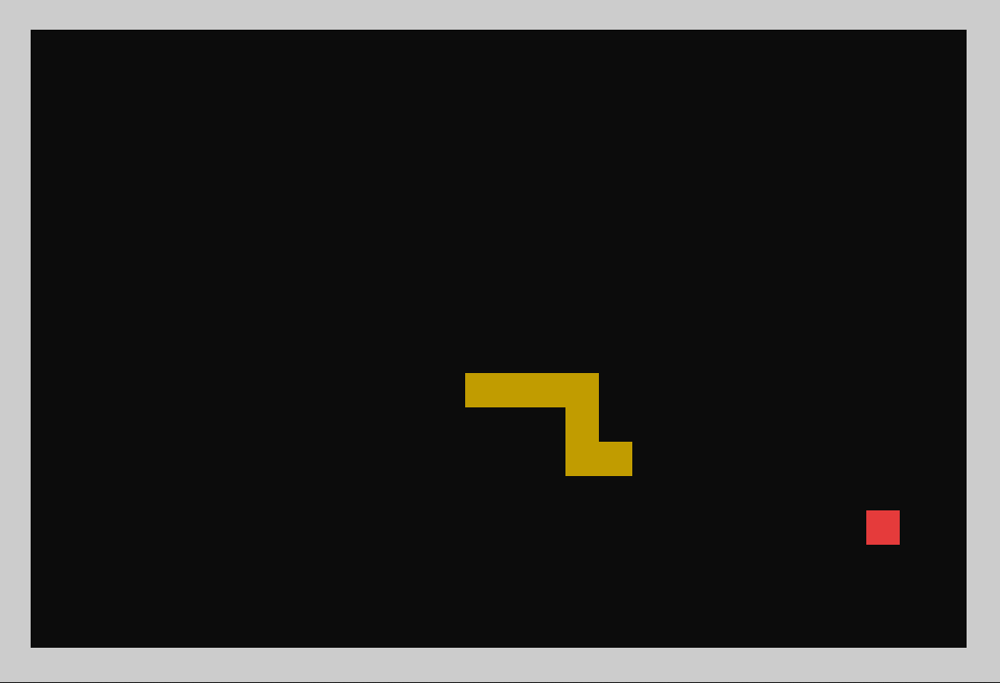
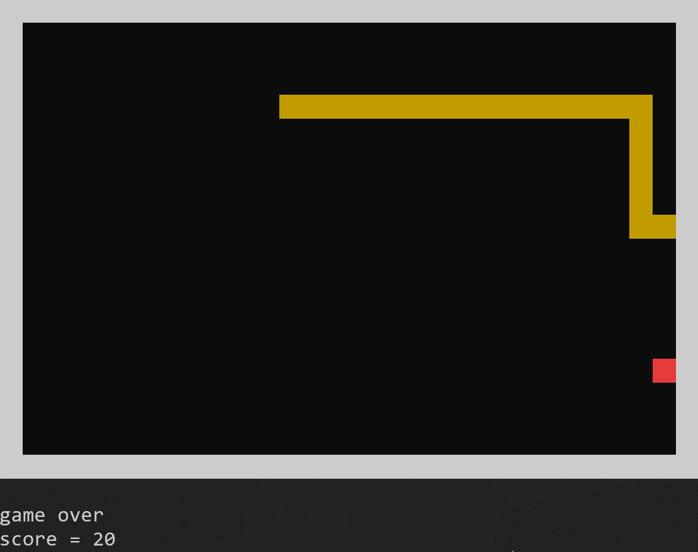

# SnakeTerm
A terminal based snake game written in C++.

## About

This was done primarly as a quick learning project to get familiar with the basics of the C++ language,
as such it doesn't have any advanced feature apart from the base snake game, with that said it is still fully-functional and playable on the terminal.

## Requirements

### Operating-system

This project was not done with portability in mind, so you will need a linux environement to run it.

### Terminal emulator

For the game to display properly, you will need a terminal emulator which supports UTF-8 characters,
also make sure that  your terminal window is large-enough or the frames will be cropped.

## Compiling

### Prerequisites

- A linux environement *(can be virtual)*.
- Any C++ compiler, *the default one is g++ but you can use a different compiler by updating the CXX field in the makefile*.

### Dependencies

This game only uses standard libraries so no additional downloads should be needed.

### How to compile :

````bash
git clone https://github.com/guilhem-alb/SnakeTerm.git
cd SnakeTerm
make
````

## Game controls

- Press the arrow keys to move.
- Press q to exit the game.

## Screenshots

|gameplay|End of game|
|---|---|
|||